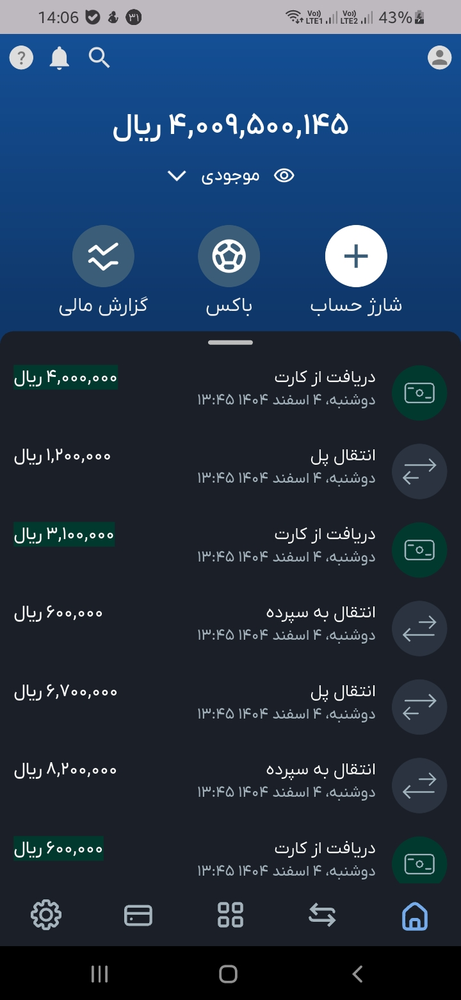

# BlueBank UI Clone

This project is a **UI-only** clone inspired by the design and style of the *Blue Bank* mobile application.  
It replicates the visual layout and interactions of a modern banking app — focusing purely on design and user experience.  
👉 **Please note:** This is **not** a real banking or financial application. It does not handle real money transactions, transfers, or account operations.

---

## 🖼️ Screenshots

Here are some preview images of the interface:

| Home Screen              | Transactions                         | Dashboard                           | Card                            | Setting                         |
|--------------------------|--------------------------------------|-------------------------------------|---------------------------------|---------------------------------|
|  |  |  |        |  |

---

## 💡 Features

- Modern and minimal design inspired by Blue Bank.
- Custom icons and color palette.
- Built for UI demonstration, prototyping, and learning purposes.
- Works fully offline — no backend integration.

---

## 🛠️ Tech Stack

Mention the frameworks or tools you used here, for example:

- Flutter 
- Dart 
- Custom components and animations

---

## ⚠️ Disclaimer

This project is **for educational and design demonstration only**.  
It is **not affiliated with Blue Bank** or any financial institution.

---

## ✨ Author

Created by [sahandfakoori](https://github.com/sahandfakoori).  
Feel free to fork, star, and use this as reference for your own UI experiments!
